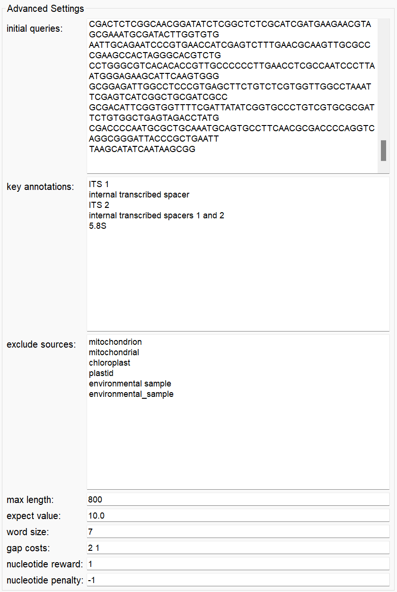
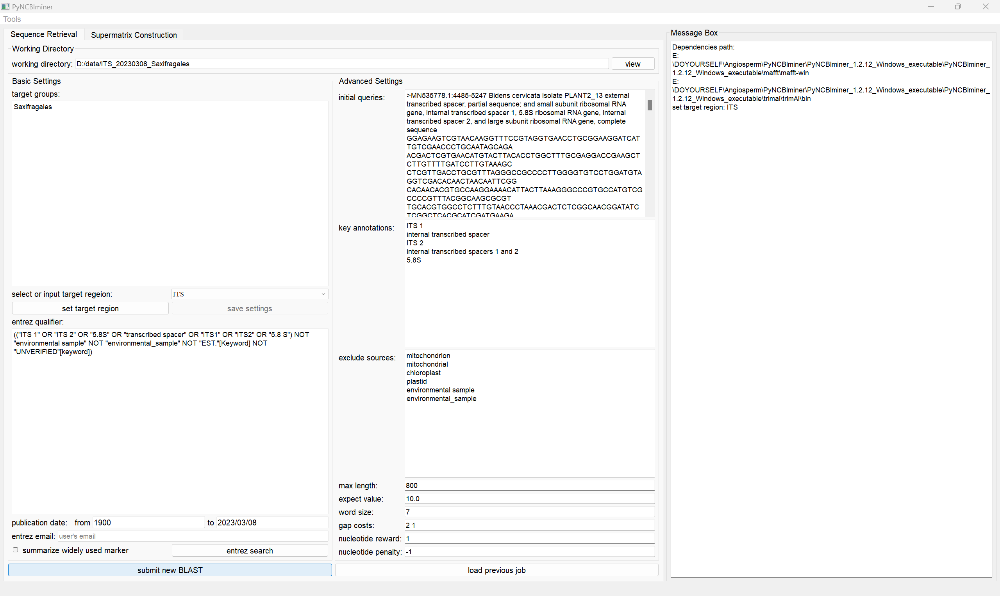

# PyNCBIminer

PyNCBIminer is a user-friendly graphical interface software designed for efficient and precise retrieval of GenBank data. Its simple operation does not require a background in bioinformatics. PyNCBIminer automatically performs BLAST iterations and optimizations based on user-provided nucleotide sequence names, target taxa, and initial reference sequences. This enhances the integrity of both sequence quantity and length, facilitating the identification and retrieval of specific gene sequence data for multiple species or taxa as specified by the user.

# 1. Download

**For windows**: Download the corresponding version of the packaged from(), users only need to unzip the package and run the.exe file directly.
**For macOS**:

# 2. Running PyNCBIminer

Double click the .exe file, 

## 2.1 Sequence Retrieving Module

The Sequence Retrieving Module is instrumental in accomplishing the primary function of PyNCBIminer, enabling the identification and download of specific gene sequence data for multiple species or taxa as specified by the user.

### **Example**

**Taxa**: Saxifragales, **Gene**: ITS

### Step 1: Set target region

**Working diretory**: The destination folder of output. 

**Basic setting**: Under the **'Basic Settings'** section, choose **'ITS'** from the dropdown options and click the `Set Target Region` button.

**Advanced setting**: After clicking the `Set Target Region` button, the **'Advanced Settings'** section will automatically configure default reference sequences and BLAST parameters. You can edit the text boxes, for more details on parameters, please refer to the [manual]().

**entrez email**: Users can restrict the search to sequences published within a specific timeframe (default: 1900-now). We recommend users to provide their email address, failure to do so may result in access being blocked by NCBI.

### Step 2: Submit BLAST

Click the `submit New BLAST` button in the 'Working directory' section to initiate the BLAST process. The process continues until no new sequences can be found, at which point the BLAST stops, and sequence downloading begins.

### Step 3: Load previous job

If you wish to resume an incomplete task, enter the working directory and click the `load Previous Job` button for loading. The program will automatically assess the progress and resume execution from the point of interruption.

### **View results**

Three folders, namely `parameters`,`results`, and `tmp_files` , will be generated in the working directory. They primarily store initial parameters, BLAST results, and intermediate files, respectively.

**1). `parameters <folder>`**:

`blast_parameters.txt <file>`:The BLAST parameters 

`initial_queries.fasta <file>`: The fasta file of initial reference sequences.

`all_new_queries_info.txt <file>`: Information about the newly selected reference sequences in each round. 

`ref_seq <folder>`: The newly selected reference sequences in fasta format.

`ref_msa <folder>`: The newly selected reference sequence alignment results.

**2). `results <folder>`**:

`blast_results.txt <file>`:The final BLAST results.

`blast_results_checked.fasta <file>`: The fasta file for correctly annotated sequences.**(We typically use this file for subsequent phylogenetic analysis.)**

`blast_results_checked_seq_info.txt <file>`: The sequence information for correctly annotated sequences.

 `erroneous_blast_results_checked.fasta <file>`: The fasta file for erroneous annotation sequences.

 `erroneous_blast_results_checked_seq_info.txt <file>`: The sequence information for erroneous annotation sequences.
 

**3). `tmp_files`**: 

For each round of BLAST, intermediate results are stored in separate subfolders with a prefix 'BLAST_' followed by numerical identifiers, created within the working directory. These subfolders individually contain the results of each round of BLAST. For more details, please refer to the [manual]().

## 2.2 Supermatrix Construction Module

### Sequence Filtering

`Control extension`: Remove errors related to sequence extension that may occur during the sequence download.

`Reduce dataset`: This function will first perform `Remove exceptional records` and `Combine species`, ultimately retaining a single representative sequence for each species.

`Remove excepetional records`: Remove sequences with specific names and lengths below a specified threshold.

`Combine species`: Rename 'subsp,' 'var,' and 'f' to the species level names.

**input path**

`Control extension` and `Reduce dataset`: The entire folder generated as output by the Sequence Retrieving Module (e.g., `D:/PyNCBIminer_data/ITS_20230308_Saxifragales <folder>`)

`Remove excepetional records`and `Combine species`: The input file(s) of sequences to be filtered in fasta format (e.g., `D:/PyNCBIminer_data/ITS_20230308_Saxifragales/results/blast_results_checked.fasta <file>`)

**output path**

The destination folder of output, where log files and result will be written

### Sequence Alignment

PyNCBIminer can perform sequence alignment using MAFFT, for more details on parameters, please refer to the [MAFFT](https://mafft.cbrc.jp/alignment/software/).

For a quick start, only input and output path are required, and are listed as below:

**input path:** The input file(s) of sequences to be aligned in fasta format. 

**output path:** The destination folder of output, where log files and result will be written.

### Alignments Trimming

PyNCBIminer can perform alignment trimming using trimAl, for more details on parameters, please refer to the [trimal](http://trimal.cgenomics.org/use_of_the_command_line_trimal_v1.2).

**input path:** The input file(s) of sequences to be aligned in fasta format. 

**output path:** The destination folder of output, where log files and result will be written.

### Alignments concatenation

PyNCBIminer can perform alignment concatenation to concatenate alignments of multiple markers to build supermatrix. Markers of each taxon from different input files will be concatenated end to end, and missing markers will be filled with gap ‘-’. For a quick start (the same is for a normal run), only input and output path are required, and are listed as below:

**input path:** The input file(s) of sequences to be aligned in fasta format. 

**output path:** The destination folder of output, where log files and result will be written.

